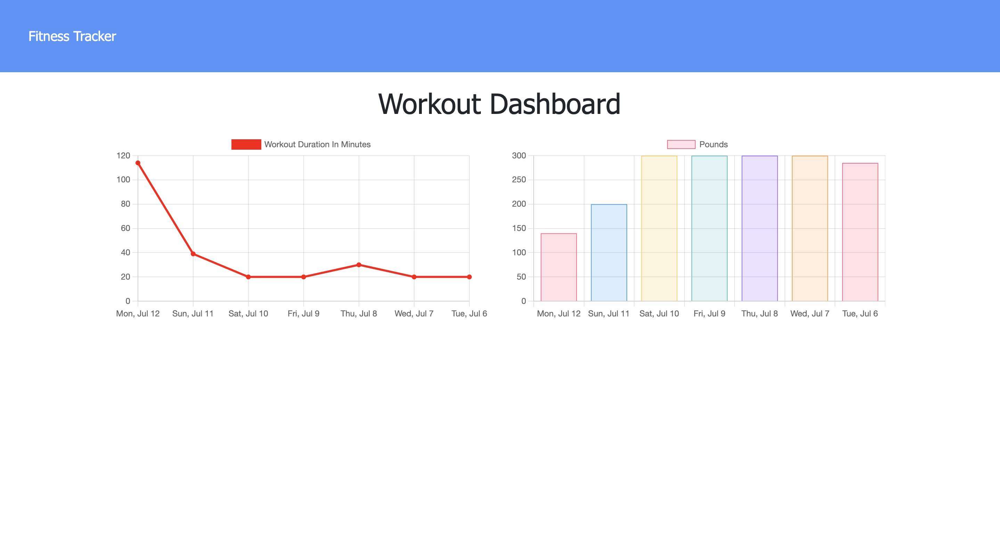

# Fitness Tracker
[](https://opensource.org/licenses/MIT)

 The fitness tracker allows the user to create a workout where they enter various exercises associated to the workout.  The data can then be analyzed with an included stats page that provides insights into the details of all their workouts.  The challenge is to connect the included frontend with a backend that is to be built using MongoDB, Mongoose and Express.

## Table of Contents
  - [Table of Contents](#table-of-contents)
  - [Installation](#installation)
  - [Usage](#usage)
  - [Features](#features)
  - [License](#license)
  - [Contributing](#contributing)
  - [Screenshots](#screenshots)
  - [Questions](#questions)

## Installation
1. Clone this GitHub repository

2. Install all dependent npm packages

   ```
   npm install --save
   ```
3. Create a MongoDB database
5. If running on a server or hosting platform add the MONGODB_URI with connection string to the environment variables
6. If needed seed the MongoDB database by running `npm run seed`


## Usage
1. Run `npm start` to start the application
2. **Continue Workout** is to continue the last workout 
3. **New Workout** to create a new workout.
4. **Add Your Exercise** allows the user to select their workout
5. Enter the details of your exercise and click **Complete** to complete the workout or **Add Exercise** continue to add other exercises
6. Click the **Dashboard** on the top navigation bar to see stats.

A demo of the application is available at: https://fitness-tracker-1402.herokuapp.com/

## Features
* Add a workout
* Add a resistance workout
* Add a cardio workout
* See a snapshot of the last workout
* See stats with charts and graphs on the overall workouts


## License
This project uses the MIT license
## Screenshots
**Home Page**


**New Workout**


**Add Exercise**


**Stats**



## Questions
Checkout my GitHub [profile](https://github.com/ryanpaynt)

Email me at: rpaynter@outlook.com